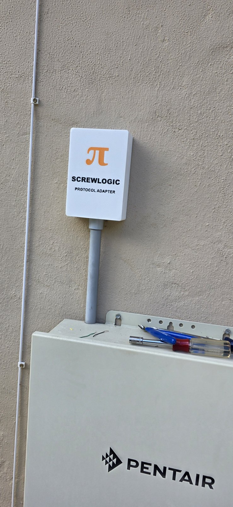
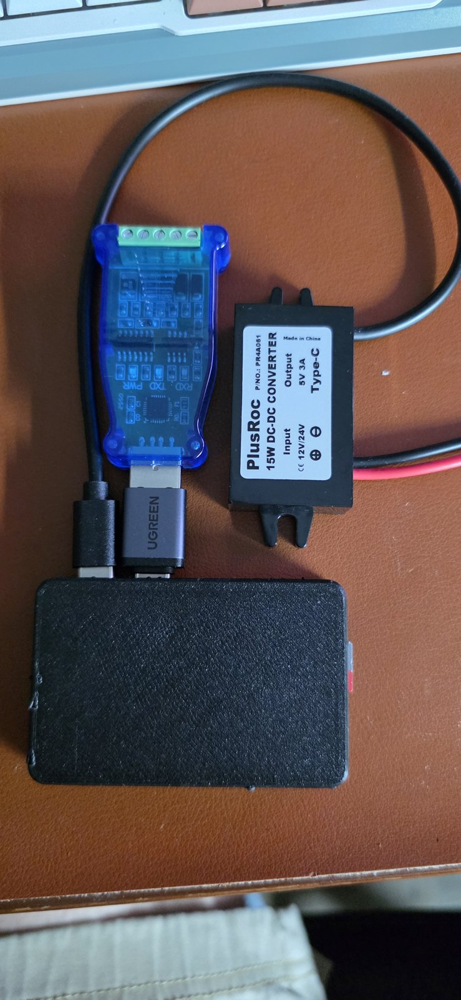
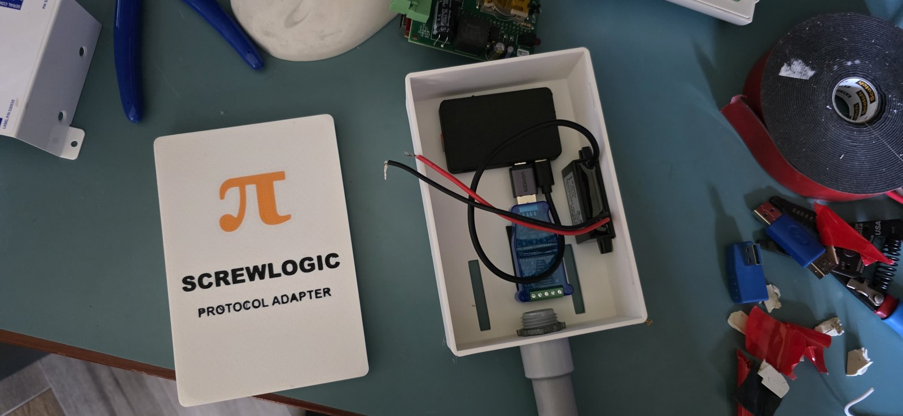
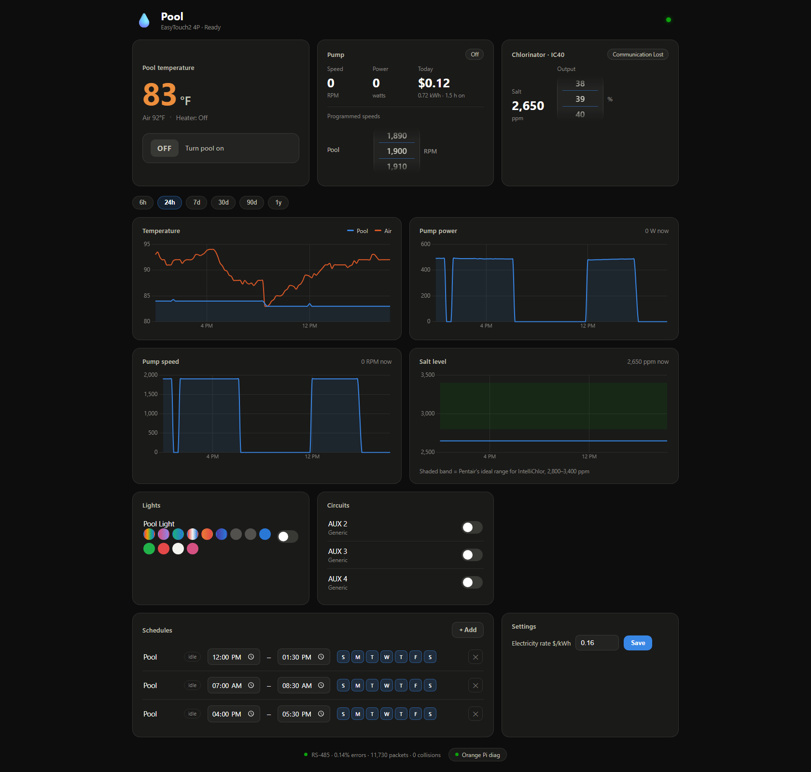
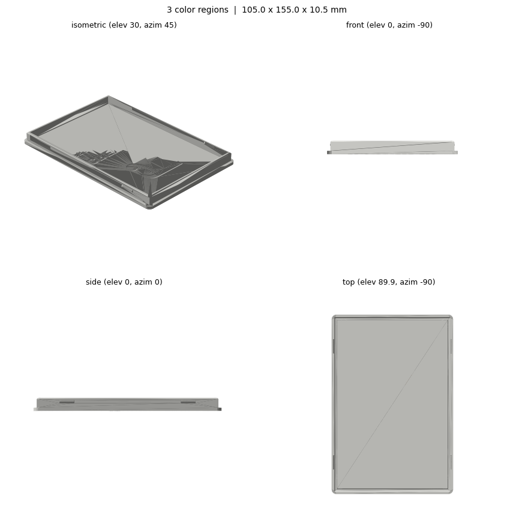

# ScrewLogic — a $70 replacement for Pentair's dead ScreenLogic adapter

<p align="center">
  
</p>

<p align="center"><em>The ScrewLogic&reg; Protocol Adapter, mounted where the old ScreenLogic wireless
transceiver used to live — reusing its conduit, its mounting slots, and its +15&nbsp;V power feed.</em></p>

My Pentair **ScreenLogic Protocol Adapter** died (RabbitCore alive, program flash corrupted, recovery
cable unobtainable). Pentair's answer is a **~$1,200 "upgrade kit"** that replaces the panel's brains.
This repo's answer is an **Orange Pi Zero 2W wired straight into the EasyTouch RS-485 bus** — about
**$70 in parts** — running the excellent open-source
[nodejs-poolController](https://github.com/tagyoureit/nodejs-poolController) plus a custom modern
dashboard. Full control from any browser: pump, chlorinator, color lights, schedules, plus history
charts, energy cost tracking, and hardware diagnostics that ScreenLogic never dreamed of.

| | |
|---|---|
|  |  |
| The whole brain: Orange Pi Zero 2W (in the small black case), SH-U10 RS-485 adapter, PlusRoc 15&nbsp;V→5&nbsp;V buck | Everything inside the printed enclosure — the old transceiver's conduit carries power + data up from the panel |

## The dashboard

<p align="center">
  
</p>

## What it does

- **Full EasyTouch control** — circuits, schedules (create/edit/delete), heat modes, a big Pool
  ON/OFF override button
- **IntelliFlo VS pump** — live RPM/watts, programmed-speed editing via smooth drum-wheel pickers,
  **real energy cost** computed from the watts the pump itself reports
- **IntelliChlor (IC40)** — salt ppm, output % control, status
- **History charts** — water/air temp, pump power & speed, salt level (with the ideal-range band),
  1-minute sampling, a year of retention, 6h→1y ranges
- **Orange Pi diagnostics** — CPU temp vs. the SoC's own throttle points, per-core CPU, memory,
  SD card, WiFi signal, temperature history (it lives in a sealed box in the sun — we watch it)
- **RS-485 bus health** — live error rate / packet counts in the page footer
- Panel clock kept correct from internet NTP (the one thing ScreenLogic somehow never managed)

Everything runs on the Pi under PM2, survives reboots and power cuts, and needs no cloud, no
account, and no Pentair anything.

## Parts list (~$70)

| Part | ≈ Price | Notes |
|---|---|---|
| [Orange Pi Zero 2W, 2 GB](https://www.amazon.com/dp/B0CHMH16X4) | $25 | quad-core A53, WiFi; 2 GB is plenty |
| [DSD TECH SH-U10 USB→RS-485](https://www.amazon.com/dp/B078X5H8H7) | $12 | CP2102, in-kernel driver, screw terminals |
| [PlusRoc 8–32 V → 5 V/3 A USB-C buck](https://www.amazon.com/dp/B09DGDQ48H) | $11 | powered from the panel's +15 V COM pin |
| USB-C male → USB-A female OTG adapter | $6 | SH-U10 into the Pi's OTG port |
| 1 A inline fuse + holder | $5 | on the +15 V feed — protect the panel |
| 32 GB high-endurance microSD | $10 | outdoor heat + power cuts kill normal cards |
| CAT5e scrap | $0 | one twisted pair for DATA+/− plus ground |

No wall wart: the EasyTouch COM port's **red terminal is +15 V DC** — the same pin that powered the
old wireless transceiver — and the buck steps it down for the Pi. One conduit, everything inside.

Optionally, a small off-the-shelf printed case for the Orange Pi itself (any Zero 2W case from the
usual model sites works — it's just mechanical protection inside the main box).

## How it works

```
EasyTouch panel ──RS-485 (yellow/green pair + gnd)── SH-U10 ──USB── Orange Pi Zero 2W
       └──────────+15V (red) ── 1A fuse ── PlusRoc buck ──USB-C──┘
Orange Pi runs:  njsPC (:4200)  ·  custom dashboard (:8080)  ·  dashPanel (:5150, diagnostic)
```

njsPC speaks Pentair's RS-485 protocol and stays the single source of truth alongside the panel
itself; the dashboard (`pool-dashboard/`, Node/Express + SQLite + Chart.js, zero build step) mirrors
its state over socket.io, logs history, and proxies control calls — so the physical panel, this
dashboard, and any wall-mounted panel never disagree.

## Build it

1. **[Pentair_njsPC_Build_Plan.md](Pentair_njsPC_Build_Plan.md)** — the complete build plan and
   running log: hardware, wiring (with the panel-power details), software phases, verification
   milestones, recovery procedure (§9a), and every gotcha we hit (vendor image ships UTC; kernel
   upgrades break the WiFi driver — hold them; njsPC recompiles at boot, be patient).
2. **[docs/pad-day-hookup.html](docs/pad-day-hookup.html)** — one-page wiring diagram + shortest
   safe hookup/test sequence for panel day.
3. **[tools/](tools/)** — provisioning scripts (Node via nvm, njsPC, PM2), a Windows→Pi SSH runner,
   and the dashboard deploy script.

Works with any panel njsPC supports; this build is verified end-to-end on an **EasyTouch2 4P**
with an **IntelliFlo VS** and an **IntelliChlor IC40**.

## Print the enclosure

<p align="center">
  
</p>

All models are in [`cad_out/`](cad_out/) — parametric build123d Python, STEP, STL, and a
multi-color 3MF:

- **Box**: [`pool-enclosure-box.stl`](cad_out/pool-enclosure-box.stl) — 100×150×42 mm interior,
  Ø21 mm pipe hole, mounting slots matching the old ScreenLogic transceiver plate
- **Lid**: [`pool-enclosure-lid-v2.3mf`](cad_out/pool-enclosure-lid-v2.3mf) — snap-fit, with the
  π / SCREWLOGIC artwork as flush multi-color inlays (print face-down; art is pre-mirrored)
- The `.py` files are the parametric sources — every dimension is a named constant

The models were generated from plain-English descriptions by
**[Claude-To-Print](https://github.com/OzAILabs/Claude-To-Print)** — a Claude Code skill that turns
a sentence into QA'd, print-ready CAD (it also boolean-verified that the lid actually snaps onto
the box before anything was printed). Want a different size or your own lid art? Grab that skill
and describe what you want.

## Security notes

- Everything is **LAN-only** by design. njsPC and the dashboard have **no authentication** — do not
  port-forward them. For remote access use something like Tailscale.
- The vendor OS image's default login is `orangepi`/`orangepi` (also used by the helper scripts in
  `tools/`) — **change it** and update the scripts if your pool matters to you.

## Standing on shoulders

- [nodejs-poolController](https://github.com/tagyoureit/nodejs-poolController) (AGPL-3.0) does the
  actual hard part — a decade of reverse-engineered Pentair protocol. This repo contains none of its
  code; the dashboard talks to its REST/WebSocket API.
- [nodejs-poolController-dashPanel](https://github.com/rstrouse/nodejs-poolController-dashPanel)
  (GPL-3.0) — used as a diagnostic during bring-up.
- Built end-to-end (research, code, CAD, docs) in a pair-programming session with
  [Claude Code](https://claude.com/claude-code).

*This project is not affiliated with, endorsed by, or particularly appreciated by Pentair.*
